# ResumeIQ — AI Resume Analyzer

<p align="center">
  <strong>AI-powered resume analysis with deterministic Java scoring, semantic requirement matching, targeted suggestions, and cover-letter generation.</strong>
</p>

<p align="center">
  
  
  
  
  
</p>

---

## Overview

**ResumeIQ** is a full-stack AI Resume Analyzer that compares a candidate's resume against a target job description.

The application accepts a **PDF or DOCX resume** and a **job description**, extracts structured information from both, identifies matched and missing skills, maps job requirements to evidence found in the resume, calculates deterministic compatibility scores, generates targeted resume-improvement suggestions, and produces a tailored cover letter.

The system uses a hybrid architecture:

- **Java / Spring Boot** handles document processing, orchestration, deterministic matching, scoring, and the web application.
- **Python / FastAPI** provides the AI/NLP service.
- **Groq-hosted LLM inference** performs structured extraction, semantic requirement analysis, suggestions, and grounded cover-letter generation.
- **HTML, CSS, and JavaScript** provide the responsive dashboard.

The scoring logic is intentionally kept outside the LLM so the AI does not arbitrarily invent the final score.

---

## Application Preview

<p align="center">
  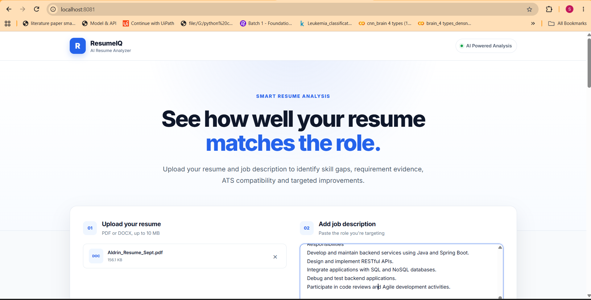
</p>

The user uploads a resume and provides the job description they want to target.

<p align="center">
  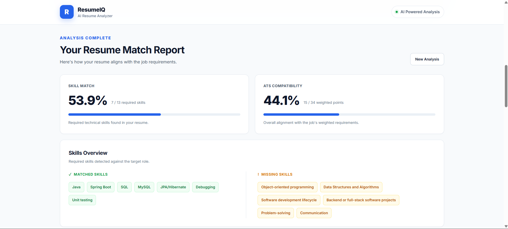
</p>

The generated report displays the **Skill Match** and **ATS Compatibility** independently.

---

## Key Features

| Feature | Description |
|---|---|
| Resume Upload | Supports PDF and DOCX resumes up to 10 MB |
| Resume Parsing | Apache PDFBox for PDF and Apache POI for DOCX |
| Text Cleaning | Normalizes extracted text while preserving technical terms |
| AI Resume Extraction | Extracts skills, experience, projects, education, achievements, research, leadership and activities |
| Job Description Analysis | Extracts required skills, preferred skills and categorized requirements |
| Skill Matching | Deterministic comparison of required JD skills against resume skills |
| Semantic Requirement Matching | Maps non-skill requirements to actual resume evidence |
| ATS Compatibility | Weighted deterministic compatibility score calculated in Java |
| Evidence Mapping | Shows why a requirement was considered matched |
| Gap Detection | Identifies required skills or requirements not supported by the resume |
| Improvement Suggestions | Generates targeted actions based on the JD and resume gaps |
| Cover Letter Generation | Creates a tailored cover letter using resume-grounded information |
| Responsive Dashboard | Presents results in a clean web interface |
| REST APIs | Spring Boot and FastAPI services communicate through JSON APIs |

---

# System Architecture

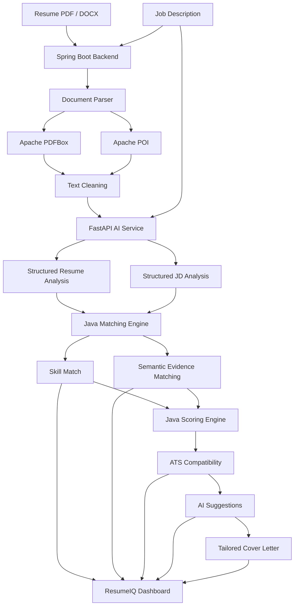

---

# Processing Pipeline

```text
Resume PDF / DOCX + Job Description
                  │
                  ▼
          Spring Boot Backend
                  │
                  ▼
       Resume File Validation
                  │
          ┌───────┴───────┐
          ▼               ▼
       PDFBox         Apache POI
        PDF              DOCX
          └───────┬───────┘
                  ▼
           Extracted Text
                  │
                  ▼
           Text Cleaning
                  │
                  ▼
        FastAPI AI Service
                  │
          ┌───────┴────────┐
          ▼                ▼
    Resume Analysis     JD Analysis
          │                │
          └───────┬────────┘
                  ▼
          Matching Engine
          ┌───────┴─────────┐
          ▼                 ▼
     Skill Matching    Evidence Matching
          │                 │
          └────────┬────────┘
                   ▼
          Java Scoring Engine
                   │
          ┌────────┴────────┐
          ▼                 ▼
      Skill Match     ATS Compatibility
                   │
                   ▼
          AI Recommendations
                   │
                   ▼
           Tailored Cover Letter
                   │
                   ▼
            Web Dashboard
```

---

# Technology Stack

### Backend

- Java 21
- Spring Boot 4.1.1
- Spring Web MVC
- Jakarta Validation
- Maven

### Document Processing

- Apache PDFBox 3.0.5
- Apache POI OOXML 5.4.1

### AI / NLP Service

- Python
- FastAPI
- Pydantic
- Uvicorn
- Groq API
- `openai/gpt-oss-120b`

### Frontend

- HTML5
- CSS3
- Vanilla JavaScript
- Fetch API

### Development & Testing

- Eclipse IDE
- PyCharm
- Postman
- FastAPI Swagger / OpenAPI
- Git
- GitHub

---

# Development Approach

The application was developed incrementally using a **phase-by-phase checkpoint approach**.

Each major component was implemented and tested independently before being connected to the complete pipeline.

## Phase 1 — Resume Parsing

The first phase focused entirely on reliable document extraction.

### PDF

PDF resumes are processed using:

```text
Apache PDFBox
```

### DOCX

DOCX resumes are processed using:

```text
Apache POI
```

### Checkpoint

```text
Resume
   ↓
File validation
   ↓
PDF / DOCX parser
   ↓
Readable resume text
```

Image-based or scanned PDFs without extractable text return a clear validation error instead of silently continuing with empty content.

---

## Phase 2 — Resume Text Cleaning

Extracted text is normalized before being passed to the AI service.

The cleaning stage handles:

- Windows and Unix line endings
- Non-breaking spaces
- Repeated spaces
- Excessive blank lines
- Leading and trailing whitespace

Technical punctuation is deliberately preserved because terms such as:

```text
C++
C#
.NET
Node.js
CGPA
dates
```

may be important resume information.

### Checkpoint

```text
Raw Resume Text
       ↓
TextCleaningService
       ↓
Clean Resume Text
```

---

## Phase 3 — Structured AI Extraction

The cleaned resume and job description are sent from Spring Boot to the FastAPI service.

### Endpoint

```http
POST /analyze
```

The AI converts unstructured text into predictable structured JSON.

### Resume information

```json
{
  "skills": [],
  "experience": [],
  "projects": [],
  "education": [],
  "certifications": [],
  "achievements": [],
  "research": [],
  "leadership": [],
  "activities": []
}
```

### Job information

The job description is separated into:

```text
Required Skills
Preferred Skills
Requirements
```

Each requirement also contains:

```text
Category
Priority
```

Supported categories include:

```text
SKILL
EXPERIENCE
PROJECT
EDUCATION
CERTIFICATION
RESEARCH
ACHIEVEMENT
LEADERSHIP
ACTIVITY
OTHER
```

Requirement priorities are:

```text
REQUIRED
PREFERRED
OPTIONAL
```

### Checkpoint

<p align="center">
  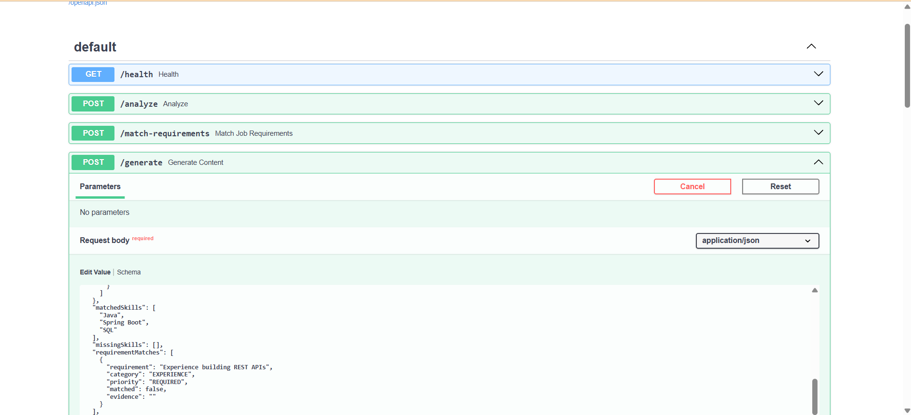
</p>

---

## Phase 4A — Deterministic Skill Matching

Required technical skills are matched in Java rather than asking the LLM to assign a score.

For every required skill:

```text
JD Required Skill
       ↓
Normalize
       ↓
Compare against Resume Skills
       ↓
Matched / Missing
```

### Skill Match Formula

```text
Skill Match % =
Matched Required Skills
──────────────────────── × 100
Total Required Skills
```

Example:

```text
Matched Required Skills = 7
Total Required Skills   = 13

Skill Match = 7 / 13 × 100
            = 53.85%
```

The dashboard displays both the count and percentage.

---

## Phase 4B — Semantic Requirement Matching

Simple string comparison is insufficient for requirements such as:

```text
Experience building backend applications
Experience working in Agile teams
Relevant project experience
Degree in Information Technology
```

For these requirements, the FastAPI AI service performs semantic evidence matching.

### Endpoint

```http
POST /match-requirements
```

The service determines:

```json
{
  "requirement": "Backend or full-stack software projects",
  "category": "PROJECT",
  "priority": "REQUIRED",
  "matched": true,
  "evidence": "Resume evidence supporting the requirement"
}
```

The model is instructed to use only information actually present in the resume.

If evidence cannot be found:

```json
{
  "matched": false,
  "evidence": ""
}
```

This allows the dashboard to explain **why** a requirement was matched rather than returning only a score.

---

## Phase 5 — ATS Compatibility Scoring

The final compatibility score is calculated deterministically in Java.

The LLM does **not** choose the score.

Requirements receive weights according to their importance:

| Priority | Weight |
|---|---:|
| Required | 3 |
| Preferred | 2 |
| Optional | 1 |

### Formula

```text
ATS Compatibility =
Earned Weighted Points
────────────────────── × 100
Total Weighted Points
```

Example:

```text
Earned Points = 15
Total Points  = 34

ATS Compatibility = 15 / 34 × 100
                  = 44.12%
```

### Why two scores?

ResumeIQ deliberately separates:

```text
Skill Match
```

from:

```text
ATS Compatibility
```

**Skill Match** measures required technical skill coverage.

**ATS Compatibility** evaluates broader weighted job requirements including skills, experience, education, projects and other relevant criteria.

> **Note:** ResumeIQ's ATS Compatibility score is an application-defined compatibility metric. It does not claim to reproduce the internal ranking algorithm of any commercial Applicant Tracking System.

---

## Phase 6 — AI Suggestions and Cover Letter

Once deterministic matching and scoring are complete, the results are passed back to the AI service.

### Endpoint

```http
POST /generate
```

Two outputs are generated independently.

### Improvement Suggestions

Suggestions focus on:

- missing requirements
- weakly communicated experience
- JD-specific keywords
- project descriptions
- technical evidence
- resume clarity

The system is instructed not to recommend fabricating qualifications.

For genuinely missing skills, the candidate may be advised to learn the technology or include it only if they actually have that experience.

### Tailored Cover Letter

The cover letter is generated from information extracted from the resume.

It is designed to:

- highlight relevant experience
- emphasize matching projects
- reference relevant technical skills
- align with the target role
- avoid intentionally inventing missing qualifications

---

## Phase 7 — Frontend Dashboard

The final phase connected the complete backend pipeline to a responsive frontend served directly by Spring Boot.

<p align="center">
  
</p>

The results follow a clear hierarchy:

```text
Scores
  ↓
Skills
  ↓
Requirement Evidence
  ↓
Improvement Suggestions
  ↓
Tailored Cover Letter
```

### Requirement Evidence

<p align="center">
  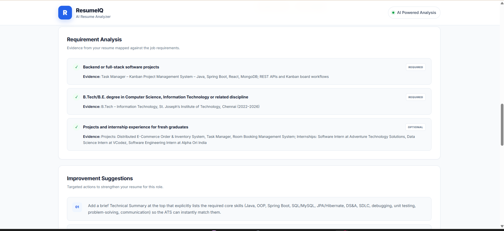
</p>

Instead of displaying only a percentage, ResumeIQ shows the resume evidence associated with job requirements.

### Improvement Suggestions

<p align="center">
  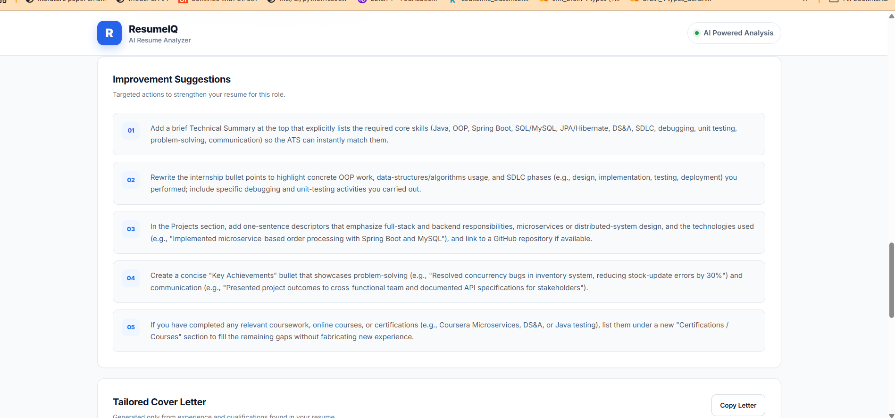
</p>

### Tailored Cover Letter

<p align="center">
  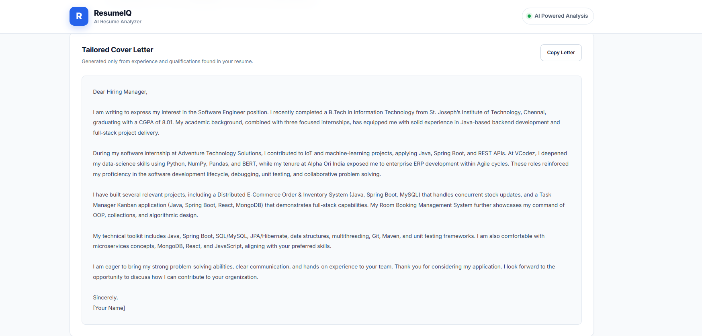
</p>

The generated letter can be copied directly from the dashboard.

---

# API Design

The application consists of two communicating services.

## Spring Boot API

### Analyze Resume

```http
POST /api/analyze
```

Content type:

```text
multipart/form-data
```

Parameters:

| Parameter | Type | Description |
|---|---|---|
| `resume` | File | PDF or DOCX resume |
| `jobDescription` | Text | Target job description |

Example using Postman:

<p align="center">
  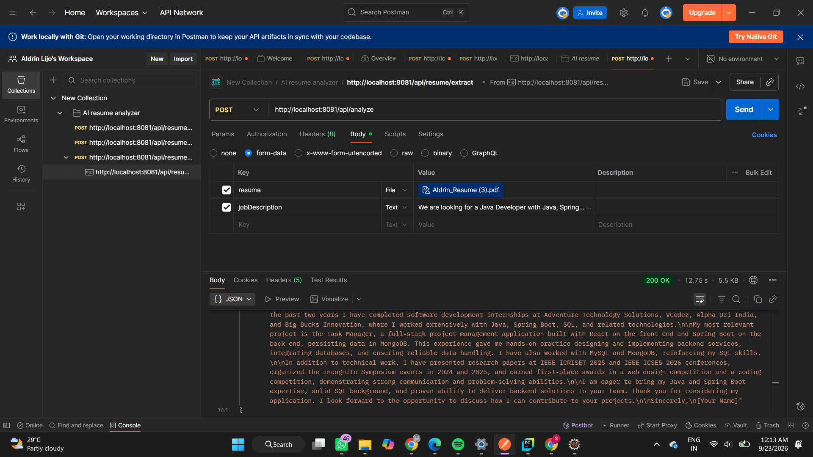
</p>

The Spring Boot API orchestrates the complete pipeline and returns the final analysis result.

---

# FastAPI AI Service

The Python service exposes the following endpoints:

| Method | Endpoint | Purpose |
|---|---|---|
| GET | `/health` | AI service health check |
| POST | `/analyze` | Resume and JD structured extraction |
| POST | `/match-requirements` | Semantic evidence matching |
| POST | `/generate` | Suggestions and cover-letter generation |

FastAPI automatically provides Swagger/OpenAPI documentation.

```text
http://localhost:8000/docs
```

<p align="center">
  
</p>

---

# Java ↔ Python Integration

Spring Boot communicates with FastAPI over HTTP.

```text
Spring Boot
    │
    │ JSON / HTTP
    ▼
FastAPI
    │
    │ Groq API
    ▼
AI Model
```

Java uses `HttpClient` with HTTP/1.1 for communication with the Python service.

```text
Spring Boot : 8081
FastAPI     : 8000
```

The services communicate locally using:

```text
http://127.0.0.1:8000
```

---

# Project Structure

```text
AI-Resume-Analyzer/
│
├── resume-analyzer/
│   │
│   ├── src/main/java/com/project/resume_analyzer/
│   │   │
│   │   ├── controller/
│   │   │   └── ResumeController.java
│   │   │
│   │   ├── dto/
│   │   │   ├── AIAnalysisRequest.java
│   │   │   ├── AIAnalysisResponse.java
│   │   │   ├── AnalysisResult.java
│   │   │   ├── ATSScoreResult.java
│   │   │   ├── GenerationResponse.java
│   │   │   ├── JobAnalysis.java
│   │   │   ├── JobRequirement.java
│   │   │   ├── MatchResult.java
│   │   │   ├── RequirementMatch.java
│   │   │   ├── RequirementMatchResponse.java
│   │   │   └── ResumeAnalysis.java
│   │   │
│   │   ├── service/
│   │   │   ├── AIService.java
│   │   │   ├── MatchingService.java
│   │   │   ├── ResumeParserService.java
│   │   │   ├── ScoringService.java
│   │   │   └── TextCleaningService.java
│   │   │
│   │   └── ResumeAnalyzerApplication.java
│   │
│   ├── src/main/resources/
│   │   ├── static/
│   │   │   ├── css/
│   │   │   ├── js/
│   │   │   └── index.html
│   │   │
│   │   └── application.properties
│   │
│   └── pom.xml
│
├── resume-ai-service/
│   ├── ai_service.py
│   ├── main.py
│   ├── models.py
│   └── .env
│
├── docs/
│   └── images/
│
├── .gitignore
└── README.md
```

> `.env`, virtual environments and generated build directories should not be committed to Git.

---

# Running the Project Locally

## Prerequisites

Install:

- Java 21
- Maven
- Python 3
- Git

A Groq API key is also required for AI inference.

---

## 1. Clone the Repository

```bash
git clone https://github.com/ALDRIN1704/AI-Resume-Analyzer.git
cd AI-Resume-Analyzer
```

---

## 2. Configure the Python AI Service

Move into the service:

```bash
cd resume-ai-service
```

Create a virtual environment:

```bash
python -m venv .venv
```

### Windows

```bash
.venv\Scripts\activate
```

Install dependencies:

```bash
pip install fastapi uvicorn groq python-dotenv
```

Create:

```text
.env
```

Add:

```env
GROQ_API_KEY=your_groq_api_key
```

> Never commit your `.env` file or API key.

Start FastAPI:

```bash
python -m uvicorn main:app --host 127.0.0.1 --port 8000
```

Expected output:

```text
Uvicorn running on http://127.0.0.1:8000
```

Swagger documentation is available at:

```text
http://localhost:8000/docs
```

---

## 3. Start Spring Boot

Open another terminal:

```bash
cd resume-analyzer
```

Run:

```bash
mvn spring-boot:run
```

Alternatively, run:

```text
ResumeAnalyzerApplication.java
```

from Eclipse as a Spring Boot application.

Spring Boot starts on:

```text
http://localhost:8081
```

---

## 4. Open ResumeIQ

Open:

```text
http://localhost:8081/
```

Then:

1. Upload a PDF or DOCX resume.
2. Paste the target job description.
3. Click **Analyze Resume**.
4. Wait for the AI and matching pipeline to complete.
5. Review the generated report.

---

# End-to-End Request Flow

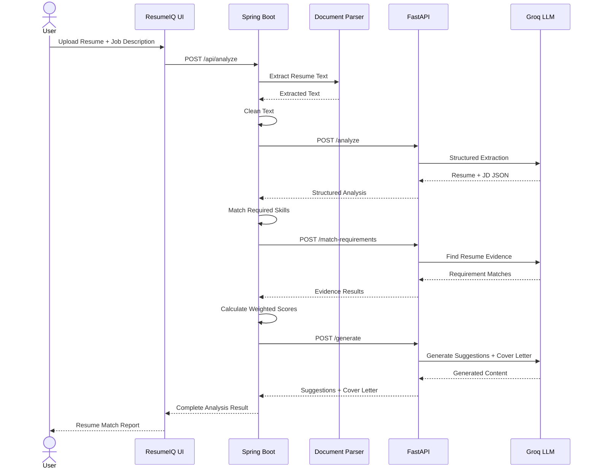

---

# Design Principles

### Deterministic scoring

The LLM extracts and interprets information, but the final scores are calculated using Java business logic.

This makes the scoring process easier to understand and reproduce.

### Evidence before claims

Semantic requirement matches include supporting resume evidence wherever possible.

### No fabricated qualifications

Generated suggestions and cover letters are designed to rely on resume-supported information rather than intentionally adding qualifications that the candidate has not provided.

### Job-dependent evaluation

Different jobs emphasize different requirements. ResumeIQ extracts requirement priorities from the supplied JD rather than using one fixed scoring template for every role.

### Separate skill and compatibility scores

Technical skill coverage and broader job compatibility answer different questions, so they are displayed independently.

---

# Error Handling

The application handles common failures including:

- Empty resume upload
- Unsupported file formats
- Empty job description
- PDF without readable text
- DOCX without readable text
- AI service communication failure
- Invalid AI response
- API processing errors

Supported resume formats:

```text
.pdf
.docx
```

Maximum upload size:

```text
10 MB
```

---

# Current Limitations

ResumeIQ is an engineering prototype and currently has several limitations:

- Scanned/image-only PDFs do not yet use OCR.
- Semantic analysis depends on an external LLM service.
- Skill matching currently relies primarily on normalized skill names.
- Skill aliases and technology equivalence can be improved.
- The application does not reproduce the proprietary scoring algorithm of any commercial ATS.
- Authentication and user accounts are not implemented.
- Analysis history is not currently persisted.
- Cloud deployment is not included in the current version.

---

# Future Enhancements

Potential improvements include:

- OCR support for scanned resumes
- Skill synonym and alias normalization
- Embedding-based semantic skill matching
- Resume section quality analysis
- Resume formatting checks
- Configurable scoring weights
- User authentication
- Analysis history
- Database persistence
- Resume comparison across multiple job descriptions
- Export analysis as PDF
- Docker containerization
- CI/CD pipeline
- Cloud deployment
- Automated tests
- Rate limiting and API resilience

---

# Development Checkpoints

| Phase | Component | Checkpoint |
|---|---|---|
| 1 | Document Parsing | PDF/DOCX text successfully extracted |
| 2 | Text Cleaning | Resume text normalized |
| 3 | AI Extraction | `/analyze` returns structured JSON |
| 4A | Skill Matching | Matched/missing skills calculated |
| 4B | Semantic Matching | `/match-requirements` returns evidence |
| 5 | Scoring | Java calculates weighted compatibility |
| 6 | AI Generation | `/generate` produces suggestions and cover letter |
| 7 | Frontend | Results displayed in ResumeIQ dashboard |
| 8 | Integration | Complete end-to-end analysis succeeds |

---

# API Testing

The APIs were tested independently during development before full integration.

### Spring Boot

Tested using **Postman** with multipart form data:

```text
resume         → File
jobDescription → Text
```

<p align="center">
  
</p>

### FastAPI

The Python endpoints were independently verified through Swagger/OpenAPI.

<p align="center">
  
</p>

This checkpoint-based development process helped isolate document parsing, HTTP communication, AI response validation, semantic matching and scoring before integrating the complete application.

---

# Backend Development

### Spring Boot

<p align="center">
  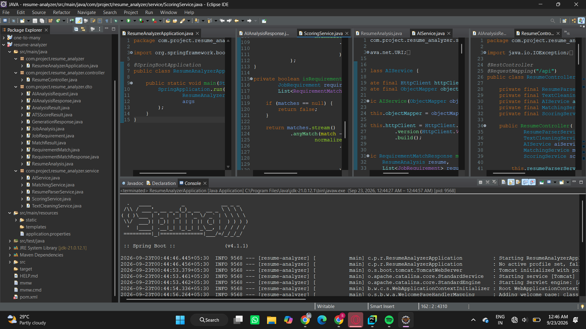
</p>

### FastAPI AI Service

<p align="center">
  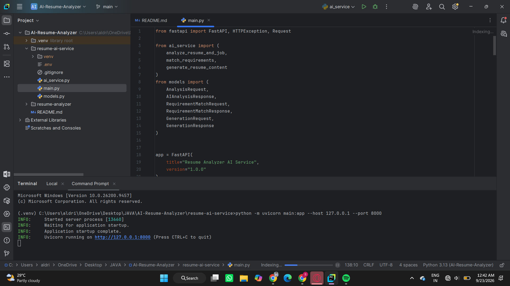
</p>

---

# Security

Sensitive configuration is stored using environment variables.

The following files/directories should be excluded from Git:

```gitignore
.env
*.env
.venv/
venv/
__pycache__/
*.pyc
target/
```

Never commit API keys directly into source code.

---

# What I Learned

Building ResumeIQ involved integrating multiple areas of software engineering:

- Spring Boot REST API development
- Multipart file handling
- PDF and DOCX document processing
- Java service-layer architecture
- Java records and DTO design
- Java HTTP client communication
- Python FastAPI development
- Pydantic request/response validation
- LLM structured JSON extraction
- Prompt design for controlled AI outputs
- Deterministic scoring algorithms
- Semantic requirement matching
- Error handling across services
- API testing using Postman and Swagger
- Responsive frontend development
- Git and GitHub version control

A major design focus was separating **AI language understanding** from **deterministic application logic** rather than allowing the LLM to control the complete evaluation.

---

# Author

**Aldrin Lijo E M**

B.Tech — Information Technology  
St. Joseph's Institute of Technology, Chennai

GitHub: [@ALDRIN1704](https://github.com/ALDRIN1704)

---

<p align="center">
  <strong>ResumeIQ</strong><br>
  Built with Java, Spring Boot, FastAPI and AI.
</p>
